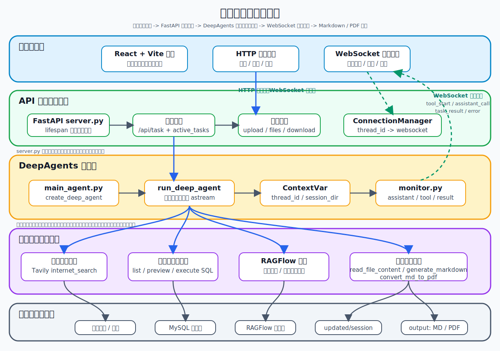

# DeepSearch

## 📖 项目介绍

在真实研究场景里，用户的问题经常不是一句普通问答可以解决的。

比如：

```text
结合公开资料、数据库信息和我上传的文档，整理一份机器人行业研究报告，并生成 PDF。
```

这个任务背后可能包含多类动作：

- 判断需要公开资料、结构化业务数据还是本次上传文件；
- 去互联网搜索最新新闻、政策、产品或行业资料；
- 到 MySQL 查询企业结构化业务数据；
- 调用文件分析助手读取文档、图片或扫描 PDF；
- 汇总多来源信息，判断资料是否足够；
- 生成 Markdown 报告，并在需要时转换成 PDF；
- 把执行过程、最终结果和生成文件实时展示给前端。

所以「深度研搜」更像一个会分工、会查资料、会生成交付物的研究助手。用户只需要提出任务，系统会在后端组织一条可观察的多智能体执行链路。

```text
用户任务
  -> FastAPI 接口接收请求
  -> 长期记忆治理：候选提取、增删、跨线程召回
  -> run_deep_agent 创建会话目录并写入上下文
  -> 统一入口推断能力范围并选择执行路线
  -> 纯网络 / 数据库 / 文件任务直达专家智能体
  -> 组合任务或文件交付回到主智能体编排
  -> 读取 governance.yml 收紧工具权限、专家范围和调用预算
  -> 主智能体汇总多来源信息
  -> Evidence Pack 记录网络、数据库、文件和多模态证据
  -> 调用文件工具生成 Markdown / PDF
  -> monitor 通过 WebSocket 推送进度，Trace Store 持久化链路
  -> 前端展示事件、答案和文件列表
```

## ✨ 项目亮点

- **一主三从的多智能体架构**
  - 主智能体负责理解任务、规划步骤、调度助手和最终汇总。
  - 网络搜索助手、数据库查询助手、文件分析助手分别处理不同信息来源。
- **意图直达路由，减少无效编排**
  - 统一入口推断网络、数据库、文件和交付物需求。
  - 纯网络、纯数据库、纯文件请求直接进入对应专家智能体，组合查询或 Markdown/PDF 交付回到主智能体。
  - 路由消融评测中，最小验收集下模型调用下降 `52.38%`，Token 下降 `75.88%`，总耗时下降 `40.36%`。
- **多来源检索，而不是模型裸答**
  - `Tavily` 负责互联网公开资料检索。
  - `MySQL` 负责查询结构化业务数据。
  - 文件分析助手负责读取和分析本次会话上传的附件。
- **配置化 Agent Governance**
  - `app/config/governance.yml` 集中声明工具白名单、路由策略、搜索/SQL 预算和专家可用范围。
  - 环境变量可覆盖预算类配置，便于演示、压测和不同环境调参。
- **Evidence Pack 证据治理**
  - 网络 URL、数据库 SQL 与结果摘要、文件/OCR 分析结果都会沉淀为可追溯证据。
  - 最终回答基于证据包约束引用、数字和来源边界，减少无依据结论。
- **从检索到交付的完整可运行链路**
  - 不停留在 Prompt 设计，而是会真实调用工具、读取数据、生成 Markdown，并在需要时转换成 PDF。
- **长任务执行过程可观察**
  - 工具调用、子智能体调用、工作目录创建、任务结果、取消和异常都会通过 `monitor` 推送到前端。
  - SQLite Trace Store 持久化任务、事件、工具调用、Agent 决策和证据记录，并提供查询接口。
- **会话级上下文隔离**
  - 通过 `thread_id` 和 `session_dir` 区分不同任务，`ContextVar` 让深层工具也能拿到当前会话身份和文件目录。
- **三层记忆边界**
  - `InMemorySaver` 保存线程内短期上下文；SQLite `BaseStore` 保存用户身份、偏好和稳定项目约束；工具结果与动态业务事实不进入长期记忆。
  - 前端持久化独立 `user_id`，新建线程后仍可召回记忆，并可在侧边栏查看、单删或全部清空。
- **OCR 与图片理解**
  - 图片和扫描 PDF 通过独立视觉模型完成 OCR、图表理解、关键数据提取和不确定项标注。
  - 图片输入会压缩到有界尺寸，扫描 PDF 默认只分析前 6 页，避免一次请求失控。
- **工程化前后端结构清晰**
  - 基于 `FastAPI + WebSocket + DeepAgents + React` 组织任务接口、异步执行、事件推送、文件上传和文件下载。
- **面向演示与扩展**
  - 核心链路包含任务路由、工具治理、长期记忆、多模态文件分析、证据治理、Trace Store 和自动评测。
  - 模块边界清晰，可继续扩展任务队列、事件持久化、鉴权与更完整的评测体系。

## 🏗️ 系统架构



项目采用 DeepAgents 中典型的 Orchestrator-Workers 模式：主智能体作为调度中心，三个专家助手负责信息获取，文件工具由主智能体直接掌握。

项目围绕两条主线展开：

| 主线             | 做什么                                                       | 涉及模块                                                                  |
| ---------------- | ------------------------------------------------------------ | ------------------------------------------------------------------------- |
| 多智能体深度研搜 | 基于用户任务完成规划、分派、检索、读取附件、汇总和生成交付物 | `DeepAgents` / `LangChain` / `LangGraph` / `Tavily` / `MySQL` / 文件分析 |
| 前后端实时闭环   | 启动后台任务、上传文件、推送执行过程、展示结果和下载生成文件 | `FastAPI` / `WebSocket` / `React` / `Vite`                                |
| 治理与证据链     | 控制工具权限、专家预算、SQL 安全和最终回答证据边界           | `Tool Allowlist` / `Agent Governance` / `governance.yml` / `Evidence Pack` |
| 可观测与评测     | 记录任务链路、统计调用成本并对比路由优化效果                 | `trace_id` / `SQLite Trace Store` / `baseline` / `routing_ablation`       |

### 智能体与工具

| 归属           | 能力                                     | 工具                                                          |
| -------------- | ---------------------------------------- | ------------------------------------------------------------- |
| 主智能体       | 任务规划、助手调度、结果汇总、文件交付   | `generate_markdown`、`convert_md_to_pdf` |
| 网络搜索助手   | 查询互联网公开信息、新闻、政策和网页资料 | `internet_search`                                             |
| 数据库查询助手 | 发现表名、预览表结构和样例数据、执行 SQL | `list_sql_tables`、`get_table_data`、`execute_sql_query`      |
| 文件分析助手   | 读取附件并完成 OCR、图片理解              | `read_file_content`、`analyze_visual_file`                    |


## 🛠️ 项目技术栈

| 模块           | 技术                                             | 作用                                                                          |
| -------------- | ------------------------------------------------ | ----------------------------------------------------------------------------- |
| 智能体框架     | `DeepAgents`                                     | 创建主智能体和子智能体，承接长任务、多工具、多助手调度                        |
| 图、检查点与 Store | `LangGraph`                                  | 提供 `InMemorySaver` 短期检查点和 SQLite `BaseStore` 长期记忆                  |
| 模型与工具抽象 | `LangChain` / `langchain-core`                   | 封装 OpenAI 兼容模型、工具声明和 Agent 调用结构                               |
| 大模型接入     | OpenAI 兼容接口                                  | 通过 `.env` 中的 `OPENAI_BASE_URL`、`OPENAI_API_KEY`、`LLM_QWEN_MAX` 接入模型 |
| 网络搜索       | `Tavily`                                         | 为网络搜索助手提供公开资料检索                                                |
| 结构化数据     | `MySQL` / `mysql-connector-python`               | 为数据库助手提供药品、库存、销售等结构化业务数据                              |
| 文件处理       | `pypdf` / `PyMuPDF` / `Pillow` / `python-docx` / `pandas` | 读取附件、渲染扫描 PDF、压缩图片、生成 Markdown/PDF               |
| 治理配置       | `YAML`                                           | 通过 `app/config/governance.yml` 管理工具白名单、路由策略和调用预算            |
| 持久化观测     | `SQLite`                                         | 保存长期记忆、任务链路、工具调用、Agent 决策和证据记录                         |
| 后端接口       | `FastAPI` / `Uvicorn`                            | 提供任务、取消、上传、文件列表、下载和 WebSocket 接口                         |
| 实时通信       | `WebSocket`                                      | 推送工具调用、助手调用、最终结果和错误事件                                    |
| 前端           | `React` / `Vite` / `Ant Design` / `Tailwind CSS` | 提供对话式研搜界面、事件流、附件上传和文件下载                                |
| 依赖管理       | `uv` / `corepack pnpm`                           | 管理 Python 后端和前端依赖                                                    |

## 📁 项目结构

```text
deepsearch-agents/
├── app/
│   ├── agent/
│   │   ├── direct/                 # 网络、数据库、文件三类直达智能体
│   │   ├── middleware/             # 工具白名单、最终回答治理等中间件
│   │   ├── subagents/              # 网络搜索、数据库查询、文件分析三个子智能体
│   │   ├── governance_config.py    # 读取 governance.yml 与环境变量覆盖
│   │   ├── llm.py                  # OpenAI 兼容模型初始化
│   │   ├── main_agent.py           # 主智能体组装与 run_deep_agent 执行入口
│   │   └── prompts.py              # 读取 app/prompt/prompts.yml
│   ├── api/
│   │   ├── context.py              # ContextVar 保存 user_id、thread_id 和 session_dir
│   │   ├── monitor.py              # 工具调用、助手调用、结果和异常事件推送
│   │   └── server.py               # FastAPI 任务、上传、文件、下载、WebSocket 接口
│   ├── config/
│   │   └── governance.yml          # 工具白名单、路由策略和调用预算配置
│   ├── evaluation/                 # 基线评测、路由消融、多模态和记忆演示脚本
│   ├── memory/                     # SQLite BaseStore、记忆提取、治理、召回与审计
│   ├── multimodal/                 # 图片压缩、扫描 PDF 渲染和视觉模型调用
│   ├── observability/              # trace、预算状态、Evidence Pack 和 SQLite Trace Store
│   ├── data/                       # 运行时生成：memory.sqlite3、trace.sqlite3，不提交
│   ├── prompt/
│   │   └── prompts.yml             # 主智能体和子智能体提示词配置
│   ├── tools/                      # Tavily、MySQL、文件读取、Markdown、PDF 工具
│   ├── utils/                      # 路径解析、Markdown/PDF 底层转换等普通 Python 工具
│   ├── output/                     # 运行时生成：每个会话的 Markdown、PDF 等产物
│   └── updated/                    # 运行时生成：用户上传文件的会话暂存目录
├── docker/
│   ├── docker-compose.yaml         # 本地 MySQL 运行环境
│   └── mysql/mysql.sql             # 药品、库存、销售记录模拟数据
├── docs/knowledge_base/            # 文件分析测试附件
├── examples/                       # 独立功能示例脚本
├── frontend/                       # React + Vite 前端项目
├── tests/                          # 测试目录
├── .env.example                    # 环境变量示例
├── pyproject.toml                  # Python 项目依赖声明
├── requirements.txt                # 依赖清单
└── uv.lock                         # uv 锁定文件
```

## 🚀 快速开始

### 1. 准备环境

- Python `3.12`
- `uv`
- Docker 与 Docker Compose
- Node.js 与 Corepack；前端命令推荐使用 `corepack pnpm`
- 可用的大模型 API Key
- Tavily API Key

### 2. 进入项目目录

```bash
cd deepsearch-agents
```

### 3. 安装后端依赖

```bash
uv sync
```

### 4. 配置环境变量

```bash
cp .env.example .env
```

按本机实际服务和密钥修改 `.env`：

```bash
# LLM 配置
OPENAI_BASE_URL=https://dashscope.aliyuncs.com/compatible-mode/v1
OPENAI_API_KEY=你的大模型_API_KEY
LLM_QWEN_MAX=qwen-max

# OCR 与图片理解；文本模型使用 DeepSeek 时需要独立配置
VISION_BASE_URL=https://dashscope.aliyuncs.com/compatible-mode/v1
VISION_API_KEY=你的视觉模型_API_KEY
LLM_VISION_MODEL=qwen-vl-max-latest

# Tavily 配置
TAVILY_API_KEY=你的_TAVILY_API_KEY

# MySQL 配置
MYSQL_USER=root
MYSQL_PASSWORD=root
MYSQL_DATABASE=deepsearch_db
MYSQL_HOST=localhost
MYSQL_PORT=3307
MYSQL_CHARSET=utf8mb4
MYSQL_COLLATION=utf8mb4_unicode_ci
MYSQL_SQL_MODE=TRADITIONAL
```

### 5. 启动 MySQL 数据库

`docker/mysql/mysql.sql` 会在 MySQL 容器首次创建数据目录时自动导入药品、库存和销售记录模拟数据。

```bash
docker compose --env-file .env -f docker/docker-compose.yaml up -d
```

### 6. 启动后端

```bash
uv run uvicorn app.api.server:app --host 0.0.0.0 --port 8000 --reload
```

后端默认接口：

| 接口                                | 说明                                   |
| ----------------------------------- | -------------------------------------- |
| `POST /api/task`                    | 启动一次 DeepAgents 后台任务           |
| `POST /api/task/{thread_id}/cancel` | 取消指定会话任务                       |
| `POST /api/upload`                  | 上传一个或多个文件到当前会话           |
| `GET /api/memories`                 | 按 `user_id` 查看长期记忆               |
| `DELETE /api/memories/{id}`         | 软删除单条长期记忆                      |
| `DELETE /api/memories`              | 清空指定用户的长期记忆                  |
| `GET /api/traces`                   | 查看任务 trace 列表                     |
| `GET /api/traces/{trace_id}`        | 查看单次任务链路详情                    |
| `GET /api/trace-stats`              | 查看 trace 汇总统计                     |
| `GET /api/files`                    | 列出当前会话输出目录中的生成文件       |
| `GET /api/download`                 | 下载输出目录中的文件                   |
| `WebSocket /ws/{thread_id}`         | 推送工具调用、助手调用、结果和异常事件 |

`POST /api/task` 的 `user_id` 为可选字段；不传时完全禁用长期记忆，兼容现有脚本和性能基线。聊天支持“记住……”“你记得我什么”“忘记……”和“忘记所有内容”。

面试时可直接运行跨线程演示：

```bash
uv run python app/evaluation/run_memory_demo.py --reset
```

### 7. 启动前端

```bash
cd frontend
corepack pnpm install
corepack pnpm dev
```

如果已经执行过 `corepack enable`，并且新终端里可以识别 `pnpm`，也可以直接使用 `pnpm install` 和 `pnpm dev`。如果 PowerShell 提示“无法将 pnpm 项识别为 cmdlet”，请使用上面的 `corepack pnpm ...` 写法。

前端默认连接：

```text
API: http://localhost:8000
WS:  ws://localhost:8000
```

如需修改，可以在 `frontend/.env.local` 中配置：

```bash
VITE_API_BASE_URL=http://localhost:8000
VITE_WS_BASE_URL=ws://localhost:8000
```

### 8. 试几个任务

```text
从数据库中查询心血管药品的库存情况，并生成 Markdown 报告。
```

```text
搜索 2026 年 AI 在电商行业的应用趋势，并结合我上传的行业资料生成一份 PDF。
```

```text
请先读取我上传的行业报告，再结合公开资料整理一份研究摘要。
```

### 9. 查看日志与离线评测

结构化 trace 日志默认保存在：

```text
app/logs/traces/YYYY-MM-DD.jsonl
```

SQLite Trace Store 默认保存在：

```text
app/data/trace.sqlite3
```

它会持久化任务运行、事件、工具调用、Agent 决策和 Evidence Pack 证据记录。可通过
`/api/traces`、`/api/traces/{trace_id}` 和 `/api/trace-stats` 查看。

离线评测只读取已有日志，不调用大模型、Tavily 或 MySQL：

```bash
uv run python app/evaluation/run_offline_evaluation.py
```

多能力性能基线默认包含网络、数据库、文件分析和组合交付任务。先使用
`--dry-run` 查看 12 次平衡运行清单，此命令不会调用任何外部服务：

```bash
uv run python app/evaluation/run_baseline.py --dry-run
```

依赖预检会发送最小 DeepSeek/Tavily 请求并连接 MySQL，但不会执行正式基线：

```bash
uv run python app/evaluation/run_baseline.py --preflight-only
```

真实基线会消耗模型和搜索额度，确认后再执行：

```bash
uv run python app/evaluation/run_baseline.py
```

也可以只运行指定任务并覆盖重复次数：

```bash
uv run python app/evaluation/run_baseline.py --tasks database_query network_search --repeat 1
```

基线报告保存在 `app/logs/baselines/`，包含模型调用次数、分 Agent 耗时、
token、工具墙钟耗时、搜索执行与拦截次数。

路由消融评测用于对比“所有任务强制主智能体编排”和“单能力任务直达专家智能体”
两种模式：

```bash
uv run python app/evaluation/run_routing_ablation.py
```

当前最小验收集包含纯网络、纯数据库、纯文件 3 组有效配对，结果显示模型调用下降
`52.38%`，Token 下降 `75.88%`，总耗时下降 `40.36%`。报告保存在
`app/logs/routing_ablation/`。

多模态演示会生成一张包含中文、数字和柱状图的图片，并验证图片与扫描
PDF 两条路径。该命令会调用视觉模型：

```bash
uv run python app/evaluation/run_multimodal_demo.py --mode both
```

### 10. 运行自动化测试

```bash
uv run python -m unittest discover -s tests -v
```

当前测试覆盖路由、工具白名单、重复调用拦截、SQL 只读校验、长期记忆持久化与用户隔离、
上传安全、多模态预处理、Evidence Pack、SQLite Trace Store、配置化 Governance 和评测函数。
最新回归结果为 `127` 项测试全部通过。

## 🚧 能力边界

当前版本重点覆盖 DeepAgents 多智能体调度、真实工具接入、长期记忆、多模态文件分析、文件交付、FastAPI 接口、WebSocket 实时推送和前后端联调，但仍不是完整的企业级生产系统。

它没有刻意展开以下生产治理能力：

- 用户登录、角色权限和多租户隔离；
- 文件上传安全扫描和内容审核；
- 任务队列、分布式执行和大规模并发治理；
- 历史会话恢复、跨实例事件总线和完整审计后台；
- 更大规模的线上评测集、持续回归和人工标注质量评估；
- 生产级 OpenTelemetry、监控告警、链路追踪和灰度发布；
- 复杂报告编辑、协同工作流和权限化文件管理。

这些能力可在现有主链路之上继续扩展，当前仓库聚焦于保持核心功能完整、可运行、可测试和便于演示。
